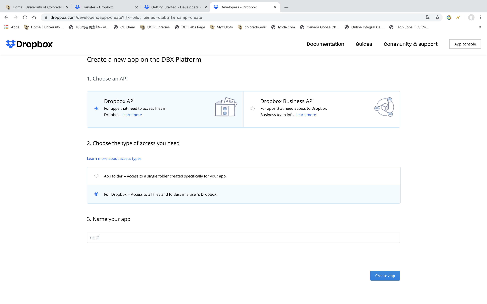
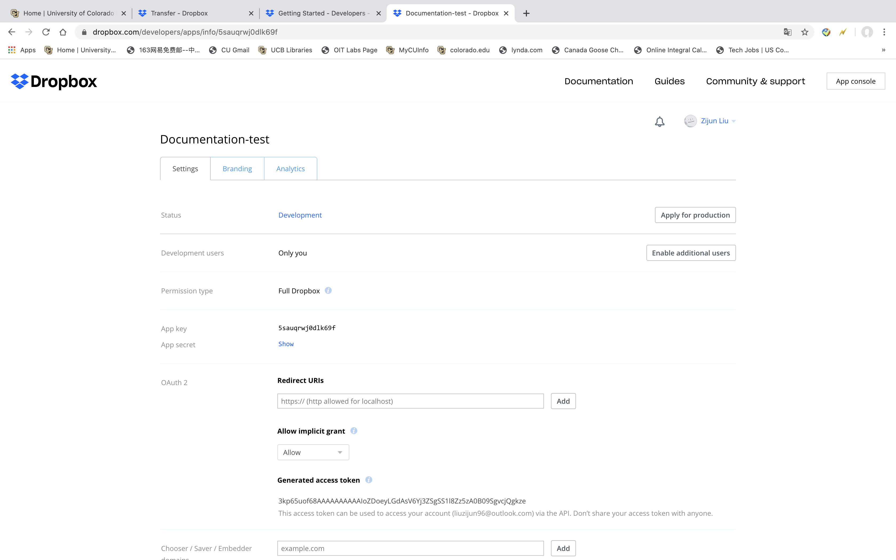

.. _DropboxIntegration:

===================
Dropbox Integration
===================
:Author:
		Robin Burke, Zijun Liu
:Version:
		June 5th, 2020

1. Introduction
===============

The Dropbox Integration is used for Librec-auto Project and this documentation is written for preparing Preceeding of 14th ACM Conference on Recommender System (RecSys' 20). I will write a documentation with full detail about how to integrate Dropbox into this project. As for the Dropbox Integration, I use Dropbox API key to upload files or whole folder into selected Dropbox drive or selected Dropbox inside folder. This Dropbox Integration would be used in *result-graphics.py* and *Dropbox-post.py* these two scripts in this Conference Documentation. 

In this Document, I would like to introduce how to install Dropbox api and secret-key.

2. Installation
===============

2.0. QuickStart Guide
---------------------

	pip install dropbox

2.1. Go to Dropbox Official Website
-----------------------------------

1. Go to website. https://www.dropbox.com/developers

2. Click **Create apps** on the page. See Figure1 below.

.. figure:: images/dropbox-integration/1.png
   :align: center
   :width: 600
   :alt: Management Tools

   *Figure1*

2.2. Create new app on Dropbox 
------------------------------

1. **Choose an API**. There are two types of Dropbox API. *Dropbox API* and *Dropbox Business API*. For personal, you can choose **Dropbox API**.

2. **Choose the type of access you need**. There are two types of access too. *App folder* means you can upload your files on selected folder. *Full Dropbox* means you can upload your files on whole drive.

3. **Name your app**. Give a name for your Dropbox API app name. i.e. *test2*. See Figure2 below.

   *Figure2*

2.3. Keep Save for your Dropbox API key
---------------------------------------

1. After you finish section 2.2. Click the *Continue* button below. You have successfully create your Dropbox API app. 

2. See Figure3 below. Figure3 is the **OAuth 2** section. The **Generated access token** is space for your Dropbox API. 

   *Figure2*

3. Secret-key
=============

3.1. Encrypted Your Dropbox API key
-----------------------------------

1. Please input your Dropbox API key into .txt file to encrypted. 

2. Run */librec-auto-library/librec_auto/encrypted.py* to encrypted your Dropbox api key. You need three files, repository for *key.key*, *Key_API_Dropbox.txt* and *Key_API_Dropbox.txt.encrypted*., to finish this steps. See *Figure4*

.. figure:: images/dropbox-integration/4.png
   :align: center
   :width: 600
   :alt: image for repository of Encrypted files.

   *Figure4*