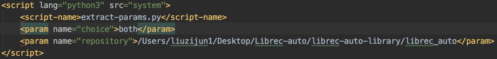

.. _ExtractParamIntegration:

===============================
Extract Experimental Parameters
===============================
:Author:
		Robin Burke, Zijun Liu
:Version:
		Sep 7th, 2020

1. Introduction
===============

The Extract Experimental Parameters is used for integration the Librec-auto Project. This Document is used for preparing In Proceeding of 14th ACM Conference on Recommender System (RecSys'20). I will write full detail with this script and what you need to have on XML file. This Extract Experimental Parameters is used in *extract-params.py* script.

In this document, I will talk about what you need to change the XML file and what mean for each functions.

2. XML file
===============

2.1. Quickstart Guide
---------------------

There are only **two** parameters have to change into XML file.

The first one is called **choice**. This is the options for control the parameters. We will talk more detail on section 2.2. Choice

The second one is called **repo**. This is the repository for where you want to store the .csv file.

   *Figure1*

2.2. Choice
-----------

There are four options for choice.

   1. **no** It means nothing to get. It will skip this script and exit only.
   2. **whole** It means export .csv file with full experimental parameters like each split number and average together.
   3. **average** It means export .csv file with only average experimental parameters.
   4. **both** It means get both of **whole** and **average** together.
