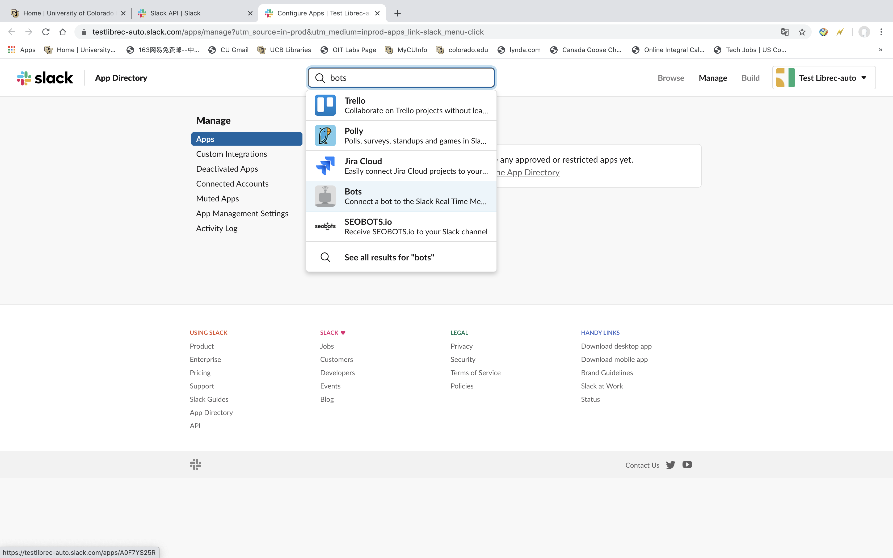

=================
Slack Integration
=================
:Author:
		Robin Burke, Zijun Liu
:Version:
		June 5th, 2020

1. Introduction
===============

The Slack Integration is based on slack api, we would like to use the slack api to link up with our own channel to post file, message into the channel. In this project, we would like to post bar plot, box plot from result-graphics.py script. Also, we can post selected files or messages into our channel in slack-post.py script. This Librec-auto Slack Integration Documentation is written for Proceeding 14th ACM Conference on Recommendation System (RecSys' 2020). 

In this document, I would like to introduce how to install slack-integration, secret-key.

2. Installation
===============

2.0. QuickStart Slack
---------------------

::

   pip install slackclient

2.1. Go to Slack Official Website
---------------------------------

2.1.1. Slack Official API Website
~~~~~~~~~~~~~~~~~~~~~~~~~~~~~~~~~

We have to go to slack api official website. Here is the link: https://api.slack.com/
            
2.1.2. Log in Slack Workspace
~~~~~~~~~~~~~~~~~~~~~~~~~~~~~

1. Click button **Go to Slack** on the right top of website. 
            
2. After click **Go to Slack**, it would show a empty space to make you log in with you own workspace. It should show like your-workspace-url.slack.com. 
            
3. Please input your workspace name. If you Slack Workspace name input correct, it would show your slack email address and password. 
            
4. After input your email and password, you would enter in your own Slack Workspace. 

2.2. Setting on Slack API
-------------------------

2.2.1. Manage Tools
~~~~~~~~~~~~~~~~~~~

1. After we finish section 2.1, we would go to our slack workspace on Desktop application. Click **downside arrow** on the name of your slack workspace. 

2. Go to **Setting & Administration**.

3. Go to **Manage Apps**. See Figure1 below.

.. figure:: images/slack-integration/1.png
   :align: center
   :width: 800
   :alt: Manage Apps on Slack Desktop

   *Figure1*

2.2.2. Set up Your API Bots
~~~~~~~~~~~~~~~~~~~~~~~~~~~~

1. After we finish 2.2.1, we would go to **Management Apps** pages. The Top page, there is an search space.

2. Click the **Search Space**. And then, we input **Bots** word. See *Figure2* below

   *Figure2*

3. There is an green button called **Add to Slack**. 

4. We click the green button **Add to Slack**. After that, we will  See *Figure3* below.

.. figure:: images/slack-integration/3.png
   :align: center
   :width: 800
   :alt: Adding Bots to a Slack workspace

   *Figure3*

5. It will show a page, it has Username informations has to be filled. This is the name for your Slack auto post robot's name. You can name anything you want. I name it as *test2*. See *Figure4* below.

.. figure:: images/slack-integration/4.png
   :align: center
   :width: 800
   :alt: Choosing a bot username on Slack

   *Figure4*

6. There is green botton called **Add bot integration** below the Username page. Click this button. 

2.2.3. Save you API key
~~~~~~~~~~~~~~~~~~~~~~~
After you follow the previous steps, you would success create an Slack API key. The **API Token** is the API key. And the **Customize Name** is Slack api bots name. See *Figure5* Please keep save for your slack API key. We would have another new feature called **secret-key** to encrypted your slack API, Dropbox API and etc. It would make your privacy more secure. 

.. figure:: images/slack-integration/5.png
   :align: center
   :width: 800
   :alt: Slack API Token

   *Figure5*

3. Secret-key
=============

3.1. Please encrypted your Slack API key
----------------------------------------

3.1.1. Encrypted Your Slack API key
~~~~~~~~~~~~~~~~~~~~~~~~~~~~~~~~~~~

1. Please input your Slack API key into .txt file to encrypted. 

2. Run ``/librec-auto-library/librec_auto/encrypt.py`` to encrypted your slack api key. You need five files, repository for:

* ``key.key``
* ``Slack_API.txt``
* ``Slack_API_encrypted.txt.encrypted``
* ``Dropbox_API.txt``
* ``Dropbox_API_encrypted.txt.encrypted``

to finish this steps. See *Figure6* and *Figure7*

.. figure:: images/slack-integration/6.png
   :align: center
   :width: 800
   :alt: Image for repository of Encrypted files.

   *Figure6*

.. figure:: images/slack-integration/7.png
   :width: 800
   :align: center
   :alt: Image for repository of Encrypted files.

   *Figure7*

3.2. Please set up your configuration fule
------------------------------------------

3.2.1. Set up Configuration file
~~~~~~~~~~~~~~~~~~~~~~~~~~~~~~~~

1. Please go to *librec-auto-sample-master/demo/conf/config.xml* to setup the environment. 

3.2.2. slack-post.py
~~~~~~~~~~~~~~~~~~~~

1. *<script-name>slack-post.py</script-name>* represent the name for the file

2. *option* means how should you want the slack do post. There are three options. 1. *No* means nothing to post. 2. *message* means post message. 3. *file* means post file. 

3. *channel* means which channel you want to post to slack. i.e. general

4. *decrypted_file, encrypted_file, key* means repository for these three files.

5. *information* is related with *option*. If the *option* is message, the *information* should *message* you want to post. If the *option* is *file*, the *information* should file repository. 

i.e. See *Figure8*

.. figure:: images/slack-integration/8.png
   :width: 800
   :align: center
   :alt: image for repository of Encrypted files.

   *Figure8*

3.2.3. result-graphics.py
~~~~~~~~~~~~~~~~~~~~~~~~~

1. The *<param name>* is almost same with slack-post setting. 

3.3. Store all of your data
---------------------------

1. As for where to store the data. I would like to store it in your local machine. Whatever you want to store. Please do not upload or share to internet. 

            
      		
