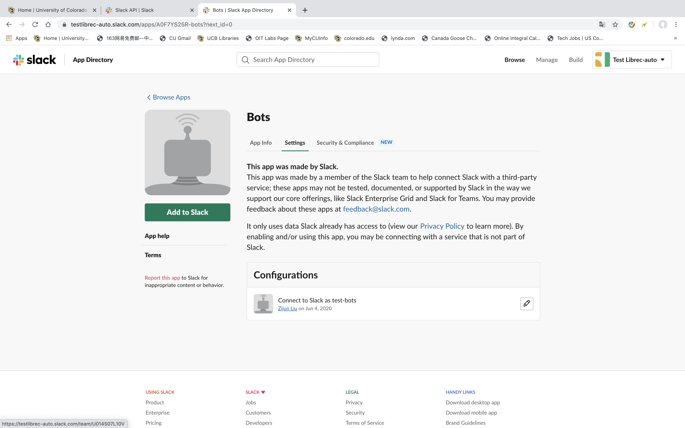
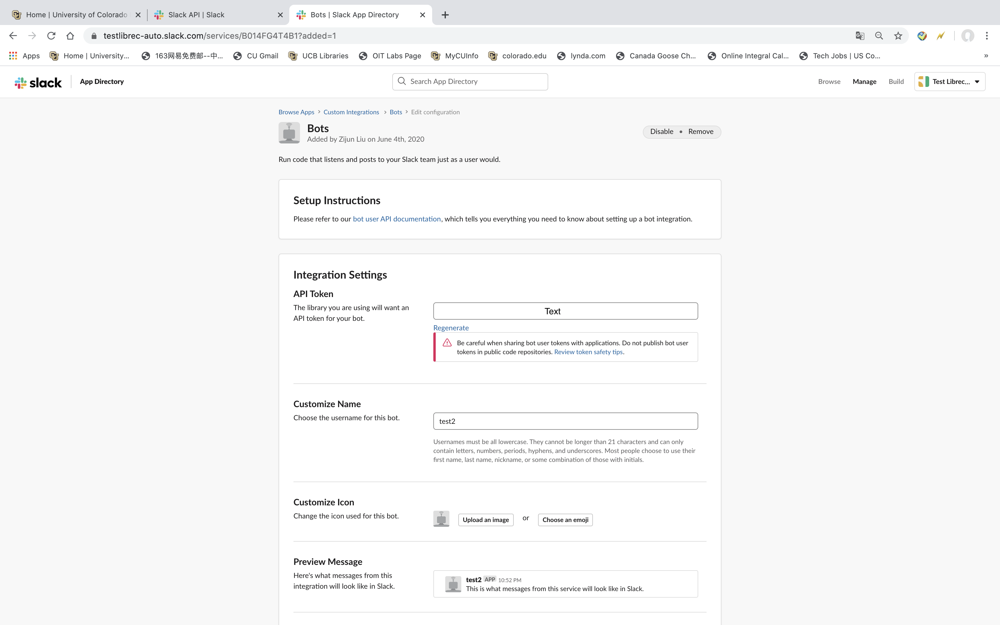

=================
Slack Integration
=================
:Author:
		Robin Burke, Zijun Liu
:Version:
		June 5th, 2020

1. Introduction
===============

The Slack Integration is based on the Slack API, and enables users to post files and message into Slack channels. The Slack API key is password-encrypted and the encrypted key can be included in a public repository (i.e. GitHub). 

2. Installation
===============

2.0. QuickStart Slack
---------------------

::

   pip install slackclient

2.1. Go to Slack Official Website
---------------------------------

2.1.1. Slack Official API Website
~~~~~~~~~~~~~~~~~~~~~~~~~~~~~~~~~

We have to go to slack api official website. Here is the link: https://api.slack.com/
            
2.1.2. Log in Slack Workspace
~~~~~~~~~~~~~~~~~~~~~~~~~~~~~

1. Click button **Go to Slack** on the right top of website. 
            
2. After click **Go to Slack**, it would show a empty space to make you log in with you own workspace. It should show like your-workspace-url.slack.com. 
            
3. Please input your workspace name. If you Slack Workspace name input correct, it would show your slack email address and password. 
            
4. After input your email and password, you would enter in your own Slack Workspace. 

2.2. Setting on Slack API
-------------------------

2.2.1. Manage Tools
~~~~~~~~~~~~~~~~~~~

1. After we finish section 2.1, we would go to our slack workspace on Desktop application. Click **downside arrow** on the name of your slack workspace. 

2. Go to **Setting & Administration**.

3. Go to **Manage Apps**. See Figure1 below.

.. figure:: images/slack-integration/1.png
   :align: center
   :width: 800
   :alt: Manage Apps on Slack Desktop

   *Figure1*

2.2.2. Set up Your API Bots
~~~~~~~~~~~~~~~~~~~~~~~~~~~

1. After we finish 2.2.1, we would go to **Management Apps** pages. The Top page, there is an search space.

2. Click the **Search Space**. And then, we input **Bots** word. See *Figure2* below

.. figure:: images/slack-integration/2.png
   :align: center
   :width: 800
   :alt: Search for "Bots" in Slack Apps

   *Figure2*

3. There is an green button called **Add to Slack**. 

4. We click the green button **Add to Slack**. After that, we will  See *Figure3* below.

   *Figure3*

5. It will show a page, it has Username informations has to be filled. This is the name for your Slack auto post robot's name. You can name anything you want. I name it as *test2*. See *Figure4* below.

.. figure:: images/slack-integration/4.png
   :align: center
   :width: 800
   :alt: Choosing a bot username on Slack

   *Figure4*

6. There is green botton called **Add bot integration** below the Username page. Click this button. 

2.2.3. Save you API key
~~~~~~~~~~~~~~~~~~~~~~~
After you follow the previous steps, you have successfully create an Slack API key. The **API Token** is the API key. And the **Customize Name** is Slack api bots name. See *Figure5*. Copy the API key to a text file. Do not store this file in your study directory with data files, etc. that you might want to share with others on GitHub, for example.

   *Figure5*

3. Integrating with librec-auto
===============================

3.1. Encrypt your Slack API key
-------------------------------

1. As above, your secret key should be stored in a secure location.

2. To encrypt the key to create a file that can be shared securely, run the script ``bin/encrypt.py``. Include the following arguments:

* ``--encrypted`` This is the file that contains the API key in encrypted form. This will typically be placed in your study directory in a directory called ``keys``. 
* ``--key`` This is the cleartext API key that you got from Slack.

The call will look like this:

``python bin/encrypt.py --encrypted mystudy/keys/slack-api.enc --key non-shared-safe-location/slack-api.key``

3. The script will prompt you for a password. You will need this password later to use the encrypted API key.

3.2. Add the script to the configuration file
---------------------------------------------

1. In order to add Slack integration to your experiment, you will need to add a ``script`` element to the post-processing portion of the configuration file. Here is an example:

::

    
 
The parameters are as follows:

* ``option`` Either ``message`` or ``file``. The above example is a ``message`` example. 
* ``channel`` The Slack channel where the message should be posted. Do not include the hashtag. 
* ``encrypted_key`` The location of the encrypted API key. This is relative to the study directory where the configuration is located.
* ``message`` The message that will be posted in the channel when the script is executed.
* ``password`` Do not include the password here. (You'll notice that the element has no content.) This is a flag indicating that the password will be entered on the command line when ``librec-auto`` is run. If you do not include it, you will be prompted for the password when the script is run, but that kind of defeats the purpose of having an automated experimental tool.

To post a file to Slack, the ``option`` element will contain the term ``file`` instead of ``message`` and there is an additional element ``file``, which gives the path to the file to be posted. Typically this will be experimental output stored in the ``post`` directory. The message will be used as a title for the file in the Slack channel. See example below:

::

   

3.3. Provide the password when running librec-auto

Use the ``-k`` or ``--key_password`` on the command line to provide the password to librec-auto. Example:

``python -m librec_auto -k my_password_here run``

The password can be shared with collaborators via some secure channel. The same password will be used for all scripts containing the empty ``<password/>`` element.

